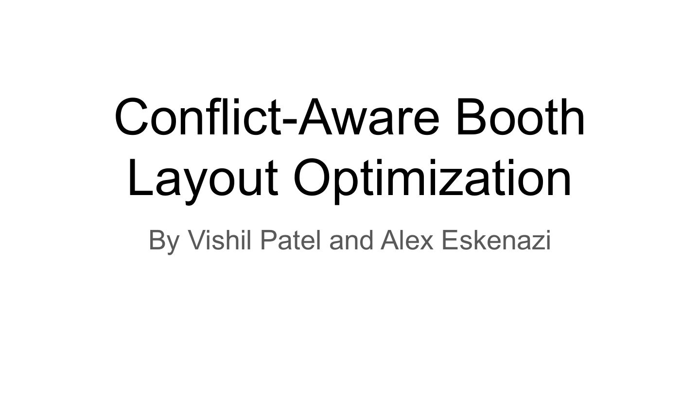
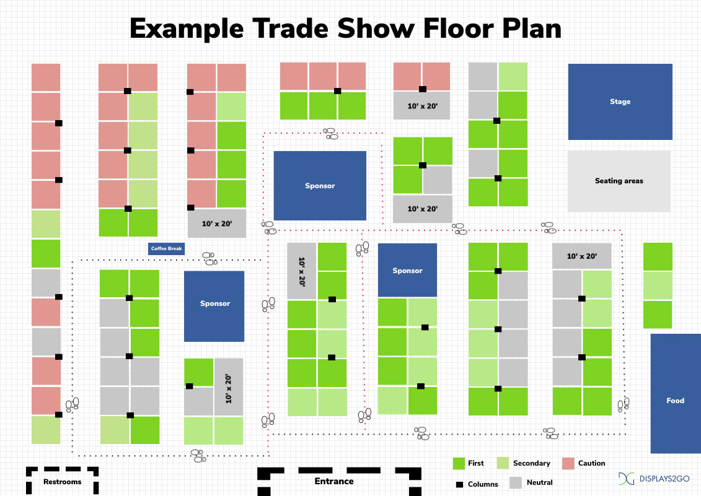
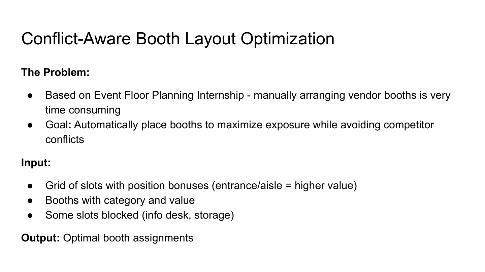
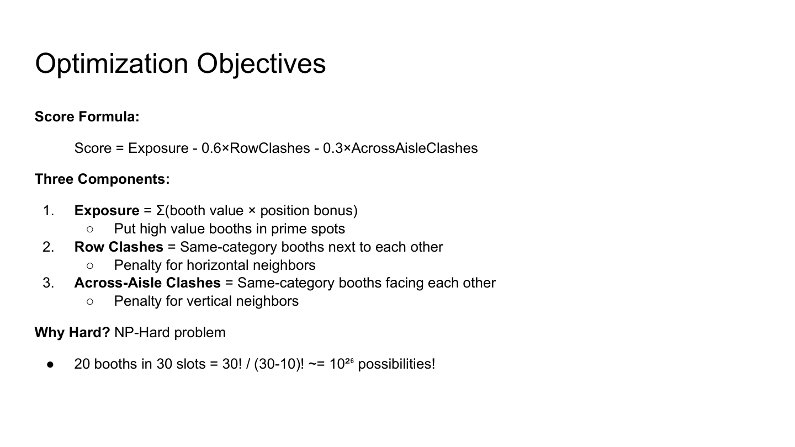
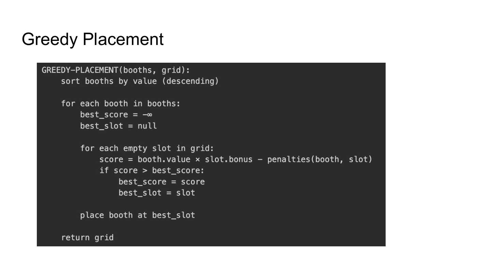
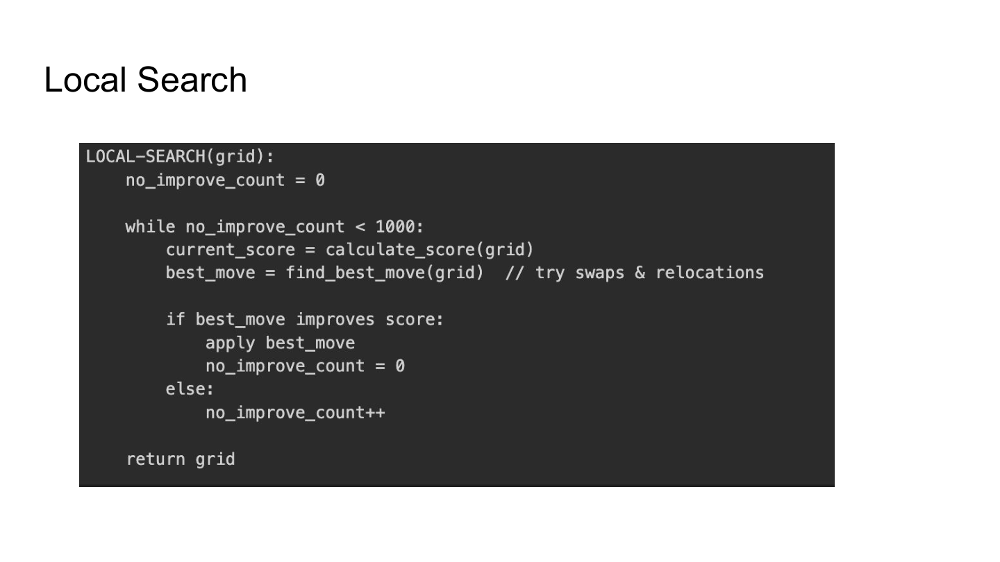
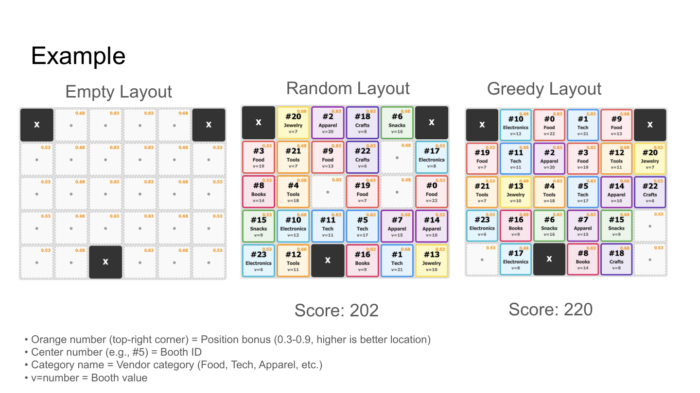
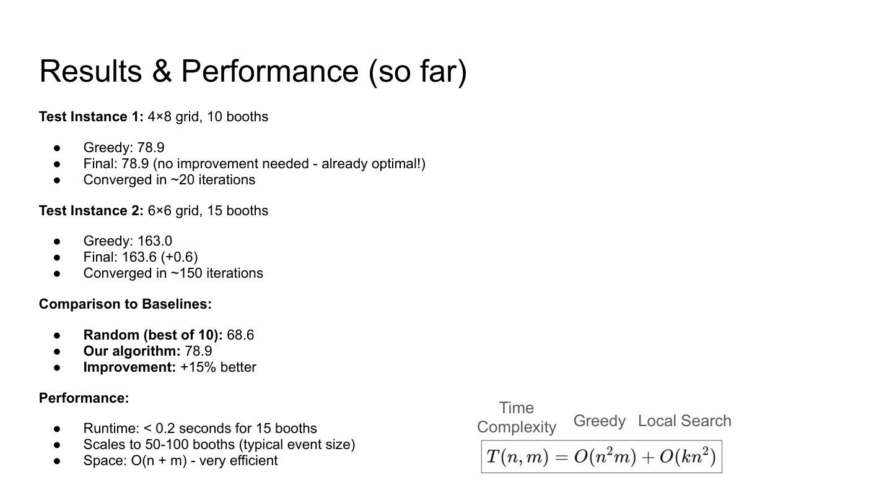

# Conflict-Aware Booth

Layout Optimization By Vishil Patel and Alex Eskenazi

## Page 1

 

## Page 2

 

## Page 3

 

## Page 4

 

## Page 5

 

## Page 6

 

## Page 7

 

## Page 8

 

## Page 9

 